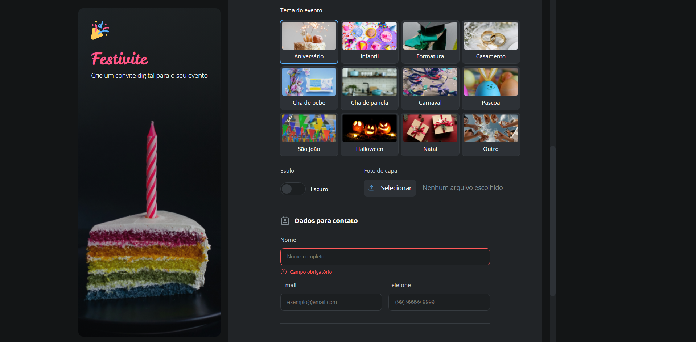

# Formulário de Convite
O Formulário de Convite é um projeto desenvolvido para permitir a personalização de convites para diferentes eventos, como festas, formaturas, casamentos e outros. O formulário coleta informações essenciais, como nome do evento, data, horário e nome dos convidados, oferecendo uma experiência intuitiva e visualmente agradável.

## Funcionalidades
1. Personalização de convites para diversos tipos de eventos.
2. Coleta de informações como nome do evento, data, horário e local.
3. Campos para alterar cores e temas dos convites.
4. Design elegante e interface amigável para facilitar o preenchimento.

## Tecnologias Utilizadas
- HTML5: Estrutura do formulário.
- CSS3: Estilização e layout do projeto.
- Git: Controle de versão para o desenvolvimento e manutenção do código.
- Google Fonts: Tipografia personalizada para um design mais sofisticado.

## Sobre o Projeto
Este projeto foi desenvolvido como parte do curso **Fullstack** da **Rocketseat**, com o objetivo de criar um formulário interativo que permita personalizar convites de maneira rápida e prática.

## Contribuições
Sinta-se à vontade para fazer um fork deste projeto e enviar pull requests. Caso tenha sugestões ou encontre algum problema, abra uma issue no repositório.
